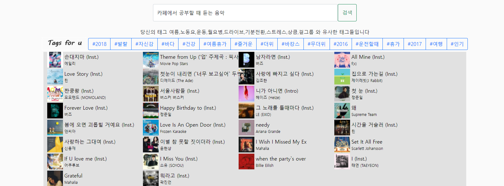
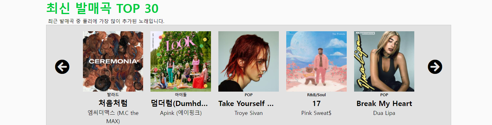
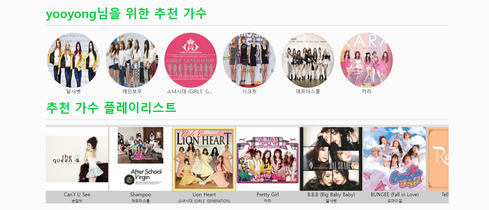
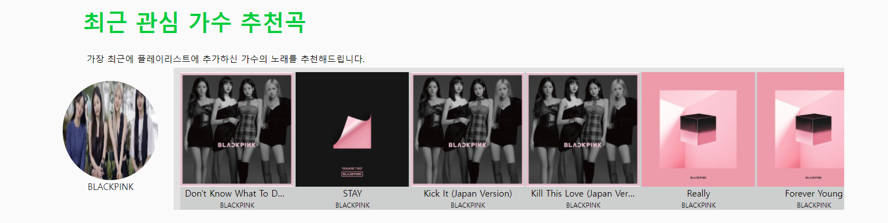
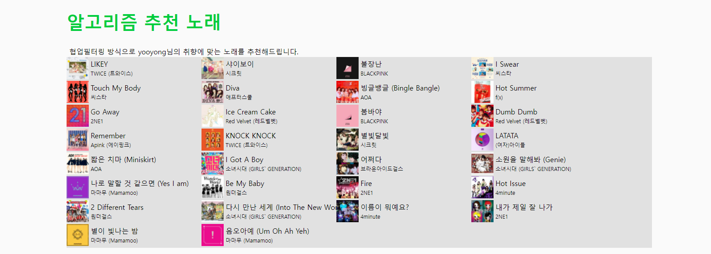
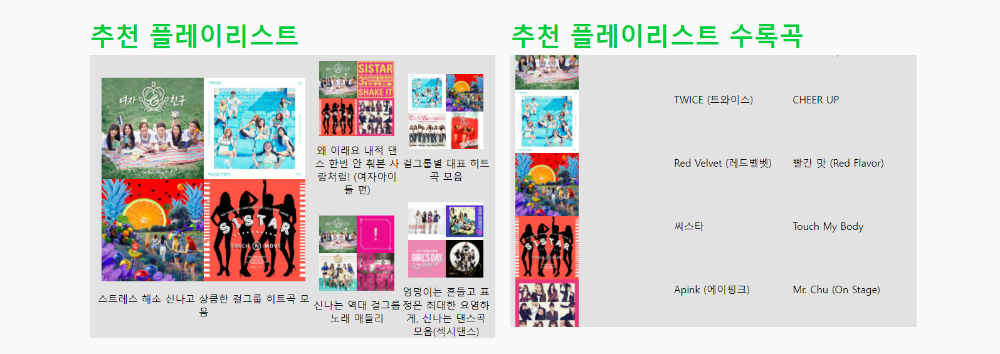

# Melon Song Recommendation
- [카카오 아레나 Melon Playlist Continuation](https://arena.kakao.com/c/8/data) 데이터를 활용한 노래 추천페이지  
  
    	  
--- 
# 사용 데이터
### song_meta.json  
- 총 707,989개의 곡에 대한 메타데이터가 수록되어 있습니다.  
**필드 설명**  
`id`: 곡 ID  
`album_id`: 앨범 ID  
`artist_id_basket`: 아티스트 ID 리스트  
`artist_name_basket`: 아티스트 리스트  
`song_name`: 곡 제목  
`song_gn_gnr_basket`: 곡 장르 리스트  
`song_gn_dtl_gnr_basket`: 곡 세부 장르 리스트  
`issue_date`: 발매일    

### genre_gn_all.json:
곡 메타데이터에 수록된 장르에 대한 정보입니다. 위 song_meta.json 에서 song_gn_gnr_basket 과 song_gn_dtl_gnr_basket 에 들어가는 정보들에 대한 메타데이터

### train.json
- 115,071개 플레이리스트의 원본 데이터가 수록되어 있습니다.  
**필드 설명**  
`id`: 플레이리스트 ID  
`plylst_title`: 플레이리스트 제목  
`tags`: 태그 리스트  
`songs`: 곡 리스트  
`like_cnt`: 좋아요 개수  
`updt_date`: 수정 날짜  

  
> 한 플레이리스트 한 유저의 취향을 대표한다고 가정하여 맞춤 추천서비스 제공  
---
# 키워드 검색 추천 / 태그 추천
`키워드 검색 추천` : **감정, 가수, 상황등을 표현하는 단어 / 문장을 입력받아 노래를 추천합니다.**   
`태그 추천` : **유저(플레이리스트)가 가지고 있는 태그를 바탕으로 좋아할만 한 태그를 추천합니다.**

### 키워드 검색 구현 방식
- `MeCab`으로 태그 + 플레이리스트 제목을 전처리
- `Sent2Vec`으로 문장 임베딩
- `hnswlib`으로 유사도가 높은 문장과 대응되는 플레이리스트 추출
- 추출된 플레이리스트 내 곡을 랜덤 출력

### 태그 추천 구현 방식
- 특정 횟수 이상 플레이리스트에 포함된 태그와 해당 태그가 포함된 플레이리스트 수록곡들의 세부장르 분포 비율을 사용한 희소행렬 생성
- `SVD` 행렬분해하여 태그 매트릭스 생성
- `hnswlib`로 cosine유사도가 높은 10개 태그 선정
    

# 최근 발매곡 top30
**데이터 기준 (2020년) 3개월 이내 발매된 곡들 중 동일기간 내 플레이리스트 포함 횟수가 많은 곡을 추천합니다.**

    

# 유저 맞춤 추천 가수
**유저(플레이리스트) 내 포함된 가수와 유사한 가수를 추천하고 해당 가수들의 곡을 추천합니다.**

### 가수 추천 구현 방식
- 플레이리스트 내 포함된 가수리스트에서 가수를 하나의 단어로 생각함
- 전체 플레이리스트 데이터를 활용해서 `word2vec`으로 가수를 임베딩
- 해당 유저 플레이리스트 내 포함된 가수를 일부 샘플링하여 벡터 평균으로 유사 가수 추천
- 결과로 나온 가수의 곡들 중 인기가 많은 곡들을 추천
- 플레이리스트에 포함된 가수의 노래중 들어보지 않은 노래도 일정 비율로 추천

    

# 최근 관심가수 노래 추천
**플레이리스트 내 마지막 추가된 곡의 가수를 최근 관심가진 가수로 가정하여 노래를 추천합니다.**

- 현재 플레이리스트에 포함되어있는 곡은 제외하고 추천
    

# 알고리즘 추천 가수
**ALS 협업필터링으로 유저 맞춤 노래를 추천합니다.**

### 알고리즘 추천 구현 방식
- 각 플레이리스트별 노래 유무를 행렬`(115071x615142)`로 표현
- ALS 협업필터링을 수행하여 현재 유저가 가진 노래를 제외하고 값이 높은 노래를 추천
    

# 추천 플레이리스트
**현재 유저의 플레이리스트와 유사한 플레이리스트를 추천해줍니다.**

### 추천 플레이리스트 구현 방식
- 플레이리스트와 플레이리스트 내 포함된 장르 분포를 행렬`(115071x249)`로 표현
- 행렬을 ALS 협업필터링으로 행렬 분해한 뒤 `item factor`로 유사도 계산
    

# 유저 페이지
유저의 플레이리스트에 있는 가수와 노래를 보여줍니다.  
추천이 유저의 플레이리스트와 비교하여 어떤 결과를 보여주는지 확인하기 위함입니다.

- `chart.js`를 활용해 장르, 가수, 시대 분포를 시각화
    

---
## 전체 뷰
### 메인 페이지 

