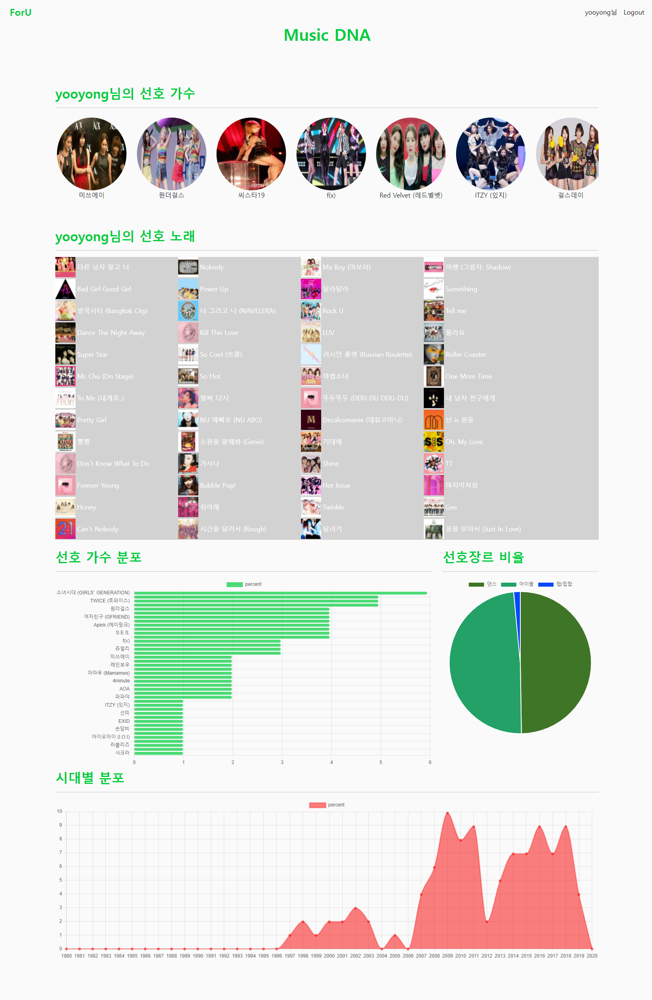

# Melon Song Recommendation
- [카카오 아레나 Melon Playlist Continuation](https://arena.kakao.com/c/8/data) 데이터를 활용한 노래 추천페이지  
  
    	  
--- 
# 사용 데이터
### song_meta.json  
- 총 707,989개의 곡에 대한 메타데이터가 수록되어 있습니다.
**필드 설명**  
`id`: 곡 ID  
`album_id`: 앨범 ID  
`artist_id_basket`: 아티스트 ID 리스트  
`artist_name_basket`: 아티스트 리스트  
`song_name`: 곡 제목  
`song_gn_gnr_basket`: 곡 장르 리스트  
`song_gn_dtl_gnr_basket`: 곡 세부 장르 리스트  
`issue_date`: 발매일    

### genre_gn_all.json:
곡 메타데이터에 수록된 장르에 대한 정보입니다. 위 song_meta.json 에서 song_gn_gnr_basket 과 song_gn_dtl_gnr_basket 에 들어가는 정보들에 대한 메타데이터

### train.json
- 115,071개 플레이리스트의 원본 데이터가 수록되어 있습니다.  
**필드 설명**  
`id`: 플레이리스트 ID  
`plylst_title`: 플레이리스트 제목  
`tags`: 태그 리스트  
`songs`: 곡 리스트  
`like_cnt`: 좋아요 개수  
`updt_date`: 수정 날짜  

---
## 웹 뷰
### 메인 페이지 

### 유저 페이지

